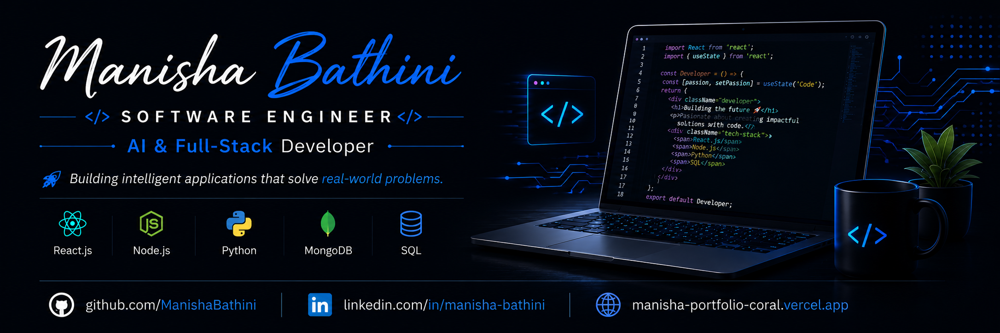

  

  
<h1 align="center">Hi 👋, I'm Manisha Bathini</h1>

<h3 align="center">
Software Developer | Full-Stack & AI Enthusiast | MCA Graduate
</h3>

Building AI-powered and full-stack web applications using modern web technologies.

---

# 👩‍💻 About Me

🎓 MCA Graduate with hands-on experience building AI-powered and full-stack web applications.

💻 I enjoy building scalable full-stack web applications using React.js, Node.js, JavaScript, SQL, and Python.

🚀 I love solving real-world problems by combining modern web technologies with AI.

🌱 Currently improving my skills in Data Structures & Algorithms, System Design, and AI.

🎯 Focused on building impactful software and continuously improving as a developer.

---

# 💻 Tech Stack

---

# 🚀 Featured Projects

## 🎤 AI Mock Interview Platform

AI-powered interview preparation platform featuring resume analysis, personalized interview questions, coding challenges, and AI-driven feedback.

**Tech Stack**

`React.js` `Node.js` `Express.js` `MongoDB` `Gemini API`

---

## 📢 AdSparks AI Agent

AI-powered marketing platform that helps businesses create, manage, and optimize advertising campaigns.

**Tech Stack**

`React.js` `Node.js` `AI APIs`

---

## 🎓 EduReach AI

AI-powered educational platform with intelligent chatbot features for students.

**Tech Stack**

`React.js` `Node.js` `MongoDB`

---

# 🌱 Currently Exploring

- 🤖 AI-Powered Application Development
- ⚛️ Advanced React.js
- 🚀 Full-Stack Development with Node.js
- 📚 Data Structures & Algorithms
- 🏗️ System Design

---

# 🤝 Let's Connect

  
  &nbsp;&nbsp;&nbsp;
  

---

### ⭐ Thanks for visiting my profile!

*"Building software that solves real-world problems, one project at a time."*

